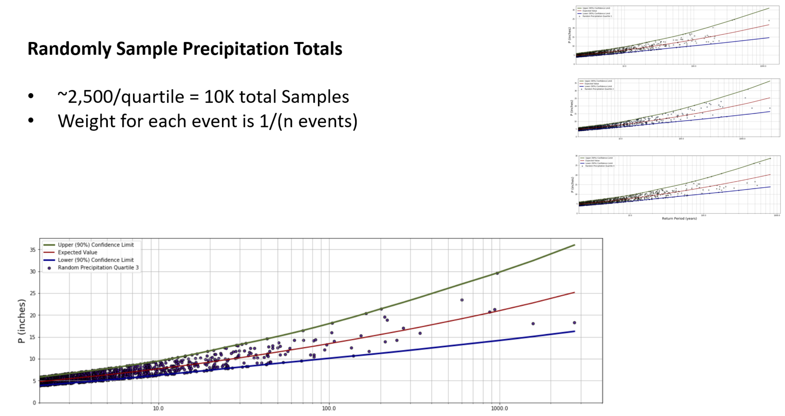

# Overview
Excess rainfall is calculated by first randomly selecting a precipitation recurrance interval and corresponding precipitation amount, precipitation temporal distribution, and curve number for the area of interest. The randomly selected precipitation data and curve number are then used by the curve number approach to calculate the excess rainfall amount for the corresponding recurrance interval. The procedure is repeated for the specified number of events/recurrance intervals. The incremental excess rainfall curves are grouped based on a novel test statistic that quantifies the incremental and cumulative volumentric differences between two curves. The mean of each group of curves is calculated and used in place of the original set of curves in order to improve modeling efficiency by reducing redundancy. Weights are assigned for each final event.

### Randomly Select Recurrance Intervals and Precipitation Amounts
For each quartile of the precipitation temporal distributions:

 - Randomly select precipitation recurrance intervals
 - Calculate the expected value, lower confidence limit, and upper confidence limit for each recurrance interval
 - Calculate the standard devation of the log-normal distribution using the lower/upper confidence limits at each recurrance interval
 - Randomly select a precipitation amount from the calibrated log-normal distributuion at each recurrance interval

### Randomly pair event (precipitation total) with a decile
Note: The decile number is randomly selected for each event, and each event is already associated with a quartile, therefore, given the quartile and the decile, the specific temporal distribution is assigned for each event.

### Randomly Select Curve Numbers
 - Add the lower and upper values of the specified curve number to a table.
 - Calculate the standard devation of the log-normal distribution for the curve number using the lower and upper values.
 - Randomly select a curve number from the calibrated log-normal distributuion at each recurrance interval.

### Calculate Excess Rainfall

### Convert Excess Rainfall to Incremental 
 - To reduce the number of hydraulic simulations necssary, group like cuves in the next step

### Perform Convolution Tests
 - Use a test statistic to evaluate shape and volume

__Test Statistic__:

### Grouped Events

### Final Set of Events to Simulate

